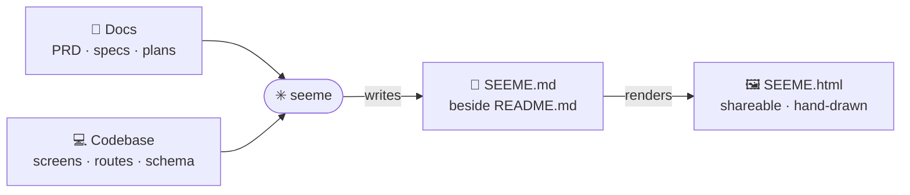

# seeme

**README tells; SEEME shows.**

> Don't just read the repo — **see** it.



seeme is an agent-native toolkit for visual product understanding in repo docs.

It has two skills:

| Skill | Output | Use when |
|-------|--------|----------|
| `seeme` | `SEEME.md`, optionally `SEEME.html` | You want a standalone visual companion for a repo or product. |
| `visualize` | Edits an existing doc in place | You want a wireframe, flowchart, sequence, or data-flow diagram inserted near relevant prose. |

`seeme` discovers repo knowledge — PRDs, plans, specs, code — and writes/refreshes **`SEEME.md`**.
It can also render that spec into a shareable **`SEEME.html`**.

`visualize` augments text-centric docs such as READMEs, getting-started guides, onboarding docs,
design docs, PRDs, plans, and specs with compact visual blocks. Re-running it on the same doc
section updates or skips its existing managed block instead of duplicating the diagram. Because it
edits docs in place, give it a target file or choose an explicit `--all` directory scan.

## Install

```sh
make install      # installs the `seeme` and `visualize` skills
make uninstall    # removes both skills
```

After installing, in any repo:

```
/seeme                     # Claude Code: create a repo visual companion → SEEME.md
/seeme <surface>           # Claude Code: cover one surface/feature/doc in SEEME.md
/seeme --update            # Claude Code: refresh an existing SEEME.md from current docs/code
/seeme render              # Claude Code: generate or replace SEEME.html from SEEME.md
/seeme --html              # Claude Code: refresh SEEME.md, then render SEEME.html
/visualize README.md       # Claude Code: insert a visual block into an existing doc
/visualize docs/guide.md onboarding
                           # Claude Code: target one section/topic
/visualize docs/ --all     # Claude Code: scan Markdown files under docs/ with guardrails
```

In Codex, choose `seeme` or `visualize` from `/skills`, or ask naturally:
*"seeme this repo"*, *"render SEEME.md"*, *"add an onboarding flow diagram to README.md"*, or
*"insert a UI wireframe into docs/getting-started.md"*. If you ask only for `visualize` without a
target, the agent should ask you to choose a specific file or an explicit `--all <directory>` scan.

## What you get

A `SEEME.md` with, per surface, the **UX-MD+Mermaid** 6-part structure:

1. Product frame & target user
2. Information architecture / navigation
3. Markdown wireframes (the real screens)
4. Mermaid flowchart (the core process)
5. Mermaid sequence diagram (user ↔ agent/app ↔ system)
6. Design principles → evidence

It is **faithful** (code is truth over stale docs), **convergent** (the things that matter, ranked),
and **renderable** anywhere. It complements — never replaces — screenshots and runtime verification.
Genuine interactive screens use `wireframe` fences (re-drawn as sketch UI); CLI output, trees, logs,
and non-UI ASCII diagrams/schemas use `terminal`/`diagram` (shown verbatim); diagrams use `mermaid`.
`screen` aliases `wireframe`; `console`/`tree`/`diagram` alias `terminal`. The renderer content-checks
tags so a mistagged transcript or schema still renders faithfully instead of being mangled into a
fake screen.

When `seeme` render mode is requested, you also get **`SEEME.html`**: derived output from
`SEEME.md` with rendered diagrams and sketch-style wireframe presentation for sharing. Markdown
renders even if Mermaid is slow or blocked; failed diagrams degrade to readable source blocks.

When `visualize` is requested, the target document keeps its prose and gains a nearby visual block
that makes a UI, process, action sequence, or data flow easier to understand. The block is wrapped in
invisible `visualize:start` / `visualize:end` comments so future runs can replace or skip it safely.
Directory scans require `--all` and are bounded to Markdown files under the requested directory.

## How it works

The synthesis is inherently an LLM task, so seeme is **skill-first**: `skills/seeme/SKILL.md` and
`skills/visualize/SKILL.md` are the instructions an agent follows. See `docs/PRD.md` and the
convention in `docs/patterns/UX_MD_MERMAID.md`. seeme dogfoods itself — see `SEEME.md`.

## License

Licensed under the **[Apache License, Version 2.0](LICENSE)**.
