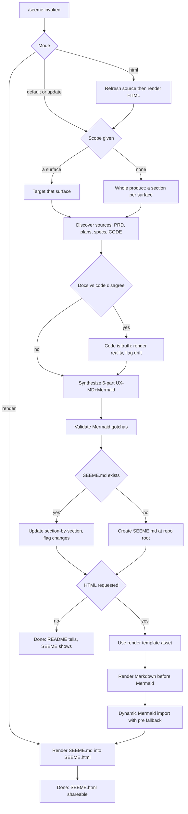
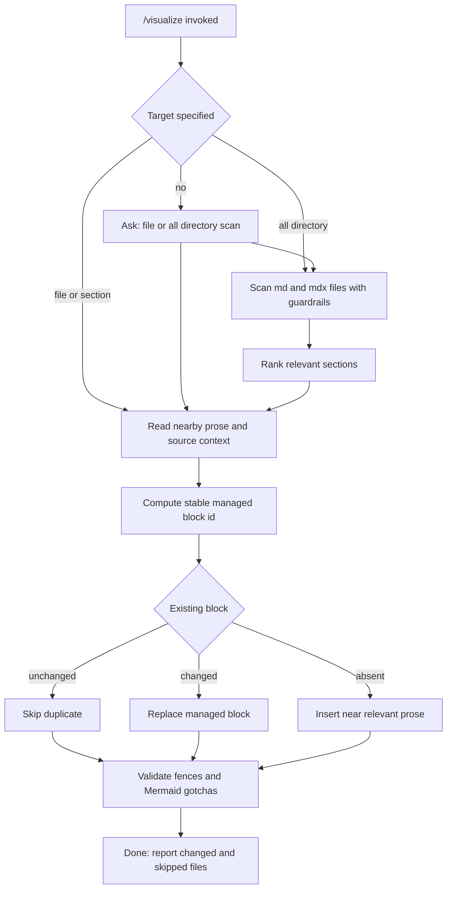
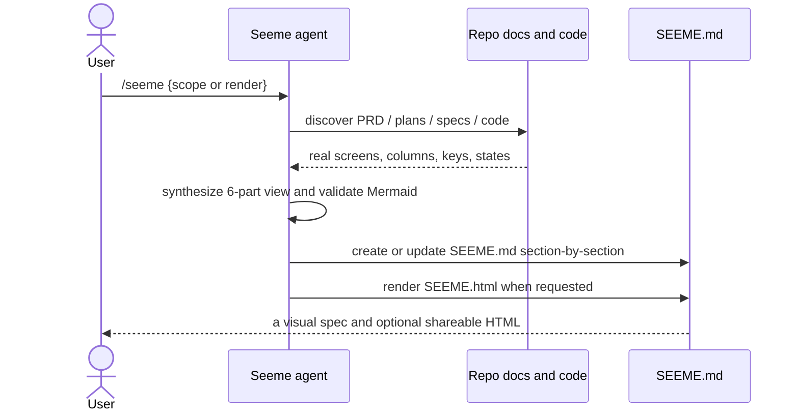
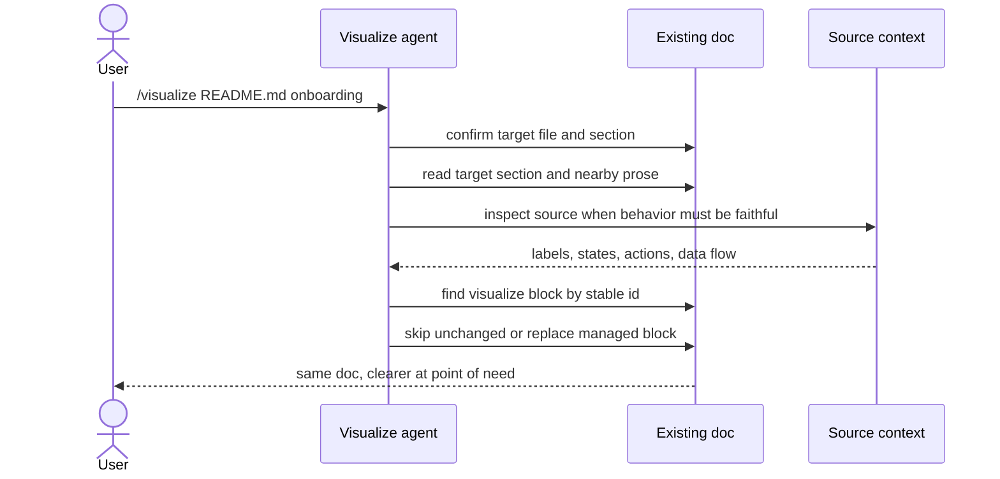

# SEEME — seeme

> Visual spec in the **UX-MD+Mermaid** convention, generated/maintained via `/seeme`.
> README tells; SEEME shows. `visualize` adds focused visuals inside existing docs.
> Freshness: reviewed via `/seeme` on 2026-06-30 at commit `b292509`.

## 1. Product frame & target user

seeme gives agents two visual documentation verbs. **`/seeme`** reads a repo's PRDs, plans, specs,
and code and writes a standalone **`SEEME.md`**: a faithful, visual explanation of the product's UIs.
When sharing is needed, it renders that source into **`SEEME.html`**. **`/visualize`** edits an
existing doc in place, adding a compact visual block next to the relevant prose.
**Target user:** anyone (human or agent) who needs to understand "what does this look like and how
does it work?" without launching it. **Success:** that understanding in minutes, on GitHub, and
refreshable in one command.

## 2. Information architecture

```terminal title="seeme information architecture"
agent skills
├─ /seeme
│  ├─ reads   → PRD · plans (docs/implementation/*_PLAN.md) · specs · architecture · CODE (truth)
│  ├─ writes  → SEEME.md  (repo root; one section per surface)
│  └─ renders → SEEME.html  (derived shareable artifact)
│               each surface = 6 parts: frame · IA · wireframes · flowchart · sequence · principles
└─ /visualize
   ├─ asks   → target file/section or explicit --all directory when omitted
   ├─ reads  → target doc section or bounded Markdown directory scan
   ├─ tracks → managed block id + source marker
   └─ edits  → insert, replace, or skip one compact visual block near relevant prose

repo layout
├─ skills/seeme/SKILL.md         the skill (canonical source; `make install` → ~/.claude, ~/.codex)
├─ skills/visualize/SKILL.md     in-place doc visual block skill
├─ docs/PRD.md                   what seeme is + the SEEME.md contract
├─ docs/patterns/UX_MD_MERMAID.md  the 6-part convention + Mermaid gotchas
└─ SEEME.md                      this file (dogfood)
```

## 3. Markdown wireframes

**(a) Invocation** — the agent surface:

```terminal title="seeme invocation"
❯ /seeme                         → SEEME.md for the whole product
❯ /seeme dashboard               → one surface
❯ /seeme --update                → refresh existing SEEME.md from current docs/code
❯ /seeme render                  → SEEME.html from existing SEEME.md
❯ /seeme --html                  → refresh SEEME.md, then render SEEME.html
❯ /visualize README.md onboarding
                                  → insert or update visual block near onboarding text
❯ /visualize docs/ --all          → scan Markdown files under docs/ with guardrails
  …or just: "seeme this repo" / "add a flowchart to the getting started guide"
```

**(b) What a generated SEEME.md looks like** (per surface):

```diagram title="generated SEEME.md structure"
┌─ SEEME.md ─────────────────────────────────────────────┐
│ 1. Product frame & target user                         │
│ 2. Information architecture / navigation   (text tree) │
│ 3. Markdown wireframes        ┌─ screen ─┐  (the real  │
│                               │ …        │   labels)   │
│                               └──────────┘             │
│ 4. Mermaid flowchart          (the core process)       │
│ 5. Mermaid sequence diagram   (user ↔ app ↔ system)    │
│ 6. Design principles → evidence  (→ real code paths)   │
└─────────────────────────────────────────────────────────┘
```

## 4. Mermaid flowchart — the /seeme process



## 4b. Mermaid flowchart — the /visualize process



## 5. Mermaid sequence diagram





## 6. Design principles → evidence

| Principle | Mechanism | Evidence |
|-----------|-----------|----------|
| **Faithful to code** | read the implementation; code wins over stale docs | step 2/F of the skill flagged drift instead of copying |
| **Show, don't tell** | wireframes + diagrams over prose | this file is mostly diagrams |
| **Convergent** | the 6–10 things that matter, ranked | per-surface, not per-screen exhaustion |
| **Renderable anywhere** | plain Markdown + validated Mermaid | the gotchas in `docs/patterns/UX_MD_MERMAID.md` |
| **Skill-first** | the synthesis is LLM work; a binary can't | `skills/seeme/SKILL.md` and `skills/visualize/SKILL.md` are the product |
| **Idempotent** | `--update` refreshes sections, keeps hand-notes | step 4 of the skill flow |
| **Shareable rendering** | HTML is derived from Markdown, not canonical | `/seeme render` produces `SEEME.html` |
| **Resilient rendering** | Markdown renders before Mermaid, diagrams degrade to source | render template avoids blank pages when CDN fails |
| **Point-of-need visuals** | in-place diagrams clarify local prose | `/visualize` edits existing docs without creating SEEME.md |
| **No duplicate diagrams** | managed block ids make reruns idempotent | `/visualize` skips or replaces existing visual blocks |
| **Bounded edits** | explicit target or `--all` directory controls blast radius | `/visualize` asks before mutating unspecified docs |
