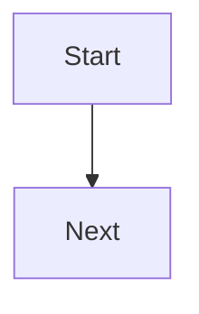

# visualize -> in-place visual doc blocks

Use this skill when the user asks to add, attach, insert, or include a visual explanation inside an
existing text-centric file. The output is an edit to the target document, not a separate visual spec.

If the user asks for a standalone repo/product visual companion, `SEEME.md`, `SEEME.html`, or an HTML
render/export of `SEEME.md`, use the `seeme` skill instead.

## What you produce

One compact visual block inserted before or after the relevant prose in the target document. In
`--all` mode, insert or update at most one compact visual block per relevant section. Choose the
smallest useful representation:

- **Markdown wireframe** for UI screens, empty states, forms, dashboards, and setup flows.
- **Mermaid flowchart** for decisions, processes, state transitions, and task flows.
- **Mermaid sequence diagram** for actor -> app -> service -> data-store handoffs.
- **Mermaid data-flow or ER-style diagram** when entities, dependencies, or data movement matter.

Preserve the surrounding prose. Do not rewrite the document unless a small bridge sentence is needed
to introduce the visual.

## Workflow

1. **Resolve the target.** Prefer an explicit Markdown file and optional section/topic. If the user
   provides no target, ask them to choose:
   - a specific Markdown file or section, or
   - `--all <directory>` to scan Markdown files in a directory.

   Do not silently mutate the whole repo. If the user provides a directory without `--all`, ask
   whether they want a specific file in that directory or an `--all` scan.

2. **Apply directory scan guardrails when `--all` is explicit.**
   - Scan only `.md` and `.mdx` files under the requested directory.
   - Skip generated or derived files such as `SEEME.md`, `SEEME.html`, `CHANGELOG.md`, vendored docs,
     dependency folders, `.git`, and build output.
   - Rank candidate sections by reader value; do not force a visual into every file.
   - Add or update at most one managed visual block per relevant section.
   - Report changed files and skipped files when finished.

3. **Read nearby context.** Read enough before and after the target prose to understand what the
   reader is trying to learn. For UI or code behavior, inspect the implementation rather than relying
   only on prose.

4. **Choose the visual.** Add one visual by default. Prefer the visual type that reduces the most
   reader effort:
   - UI/state explanation -> Markdown wireframe.
   - Process or decision path -> Mermaid flowchart.
   - Interaction across actors/systems -> Mermaid sequence diagram.
   - Data ownership or movement -> Mermaid data-flow or ER-style diagram.

5. **Compute a managed block id.** Use a stable slug derived from target path, section/topic, and
   visual type, such as `README.md#getting-started-onboarding-flow`. Normalize to lowercase
   letters, digits, and hyphens for the `id` value.

6. **Insert, replace, or skip.** Put the visual immediately after the prose it clarifies unless the
   visual works better as a preview before a long explanation. Keep headings and anchors stable.
   Before editing, scan the target file for an existing managed block with the same `id`.
   - If the block exists and the visual content is effectively unchanged, leave it untouched.
   - If the block exists and the visual should change, replace only the content between its markers.
   - If no matching block exists, insert a new managed block at the chosen location.
   - Never create a second managed block with the same `id` unless the user explicitly requests an
     alternative visual; then use a distinct `id`.

7. **Validate Markdown and Mermaid.**
   - Keep fences balanced.
   - Flowchart node labels: no raw `(` `)` `[` `]` inside `[...]` or `{...}`.
   - Sequence messages/aliases: no `<...>` angle brackets; write `{slug}` or `SLUG`.
   - Edge labels: avoid a bare `/`; write `slash`, `run`, or another word.
   - If `mmdc` is available, render Mermaid blocks; otherwise sanity-check the gotchas by inspection.

## Managed block format

Wrap every generated visual block in invisible Markdown comments:

````md
<!-- visualize:start id="getting-started-onboarding-flow" source="README.md#getting-started" -->

<!-- visualize:end -->
````

- `id` is the stable deduplication key for repeated runs.
- `source` identifies the doc path and heading, anchor, or nearby prose the visual explains.
- The generated visual lives between `visualize:start` and `visualize:end`.
- On repeat runs, match by `id`, then skip unchanged content or replace the managed block.

## Output discipline

- Edit the existing target file in place.
- Require either an explicit file/section target or an explicit `--all <directory>` scan.
- Add one compact visual unless the user asks for multiple visuals.
- Wrap each generated visual in a managed `visualize:start` / `visualize:end` block.
- Keep visuals faithful to implementation or source text; do not invent UI, fields, states, or flows.
- Keep visuals plain Markdown and Mermaid so they render in GitHub and common Markdown previewers.
- Do not create or update `SEEME.md` or `SEEME.html`; route those requests to `seeme`.

## Anti-patterns

- Don't append a visual at the end when there is a more relevant insertion point.
- Don't add a large diagram for a small paragraph.
- Don't duplicate prose in diagram form without adding clarity.
- Don't convert a whole doc into visuals; this skill augments targeted explanations.
- Don't scan or mutate all docs unless the user explicitly selected `--all <directory>`.
